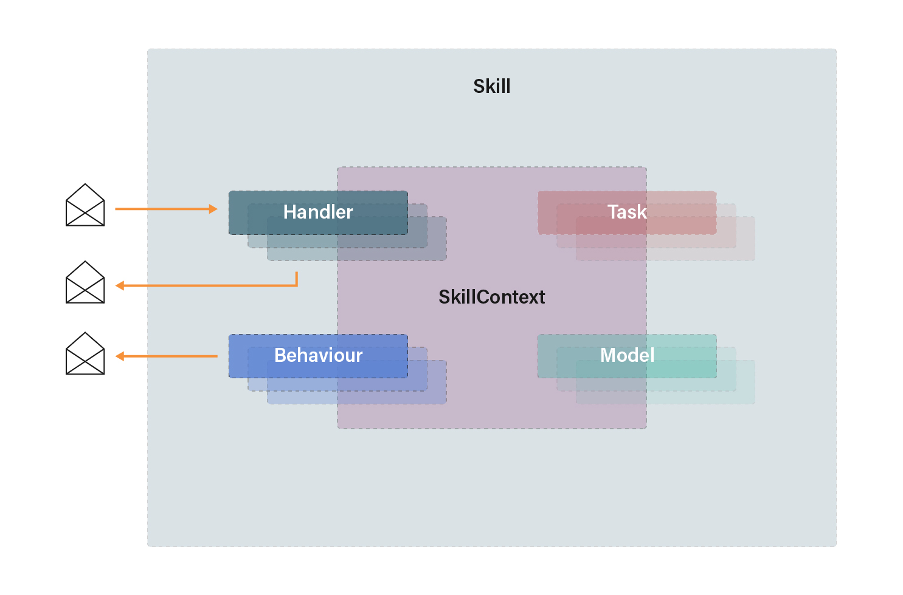

# AEA Implementation

!!!note
    It is assumed the reader has some familiarity with the
    [open AEA framework](https://github.com/valory-xyz/open-aea).
    See this __[introductory guide to the framework](https://valory-xyz.github.io/open-aea/)__ to help you get started in case you're not yet familiar.

!!!note
    The snippets of code presented here are a simplified representation of the actual
    implementation. We refer the reader to the corresponding API documentation for the complete details.

This section merely serves as a summary, showcasing some aspects of the
implementation that are relevant for developers, and providing easy access to
sections in the guide and API documentation related to the concepts discussed.


## AEA Main Components

Every AEA is composed of a number of components that work together to achieve the pre-defined goals of the agent:

- The [`DecisionMaker`](https://valory-xyz.github.io/open-aea/decision-maker/)
is where the developers' or users' goals, preferences, message handling and wallet
control reside.
- [`Skills`](https://valory-xyz.github.io/open-aea/skill/), which
allow them to operate proactively, through the expression of
[`Behaviour`](https://valory-xyz.github.io/open-aea/api/skills/base/#behaviour-objects),
as well as reactively by managing incoming messages from other agents via a
[`Handler`](https://valory-xyz.github.io/open-aea/api/skills/base/#handler-objects). Every `Skill` is associated with an AEA, since it is registered to it.
- Since there might exist a need to share a certain context which is relevant both
to behaviors and handlers, this can be achieved via a
[`Model`](https://valory-xyz.github.io/open-aea/api/skills/base/#model-objects).


- [`SkillContext`](https://valory-xyz.github.io/open-aea/api/skills/base/)
and
[`AgentContext`](https://valory-xyz.github.io/open-aea/api/context/base/)
allow Skills and agents, respectively, have their own `Context` attributes.
However, each of these provides access to a shared state.
This shared state is what agents can alter through the usage of skills.



## AEA Communication

AEAs interact with other agents, either within the same Valory app, and/or with agents in the outside world, via
[interaction protocols](https://valory-xyz.github.io/open-aea/interaction-protocol/).
In order to locate other agents, they connect to the
[Agent Communication Network (ACN)](https://valory-xyz.github.io/open-aea/acn/).
More specifically, AEAs communicate asynchronously with other agents using
[`Envelopes`](https://valory-xyz.github.io/open-aea/api/mail/base/#envelope-objects)
that contain a [`Message`](https://valory-xyz.github.io/open-aea/api/protocols/base/).
These messages adhere to specific messaging
[protocols](https://valory-xyz.github.io/open-aea/protocol/).
In order for AEAs to communicate with agents in the outside world they need to
set up a [connection](https://valory-xyz.github.io/open-aea/connection/), which
is managed by the
[`Mutliplexer`](https://valory-xyz.github.io/open-aea/api/multiplexer/).
The execution of smart
[`Contract`](https://valory-xyz.github.io/open-aea/contract/)
related logic, for example, requires a connection to provide the agent with the
necessary network access.


The [`AbstractAgent`](https://valory-xyz.github.io/open-aea/api/abstract_agent/)
simply defines all the strictly necessary methods and properties required to
implement a concrete [`Agent`](https://valory-xyz.github.io/open-aea/api/agent/),
a part of which is shown here.
Their [`Identity`](https://valory-xyz.github.io/open-aea/api/identity/base/)
provides access to any associated `addresses` and `public_keys`.
A list with [`Connections`](https://valory-xyz.github.io/open-aea/api/connections/base/)
allows agent-to-agent communication.
What is most important in the following sections is the `act()` method, which
allows the agent to express proactive and reactive skills.


The [`AEA`](https://valory-xyz.github.io/open-aea/api/aea/) inherits from the
[`Agent`](https://valory-xyz.github.io/open-aea/api/agent/) and extends it with
additional functionality, the most important of which for us to consider here
being the
[`DecisionMaker`](https://valory-xyz.github.io/open-aea/api/decision_maker/base/),
[`wallet`](https://valory-xyz.github.io/open-aea/api/crypto/wallet/),
[`resources`](https://valory-xyz.github.io/open-aea/api/registries/resources/)
and agent [`context`](https://valory-xyz.github.io/open-aea/api/context/base/).

The [`DecisionMaker`](https://valory-xyz.github.io/open-aea/api/decision_maker/base/)
provides the agent with decision-making logic required for message handling.
It contains:

  - [`Preferences`](https://valory-xyz.github.io/open-aea/api/decision_maker/base/#preferences-objects)
    used to check whether a proposed
    [`Transaction`](https://valory-xyz.github.io/open-aea/api/helpers/transaction/base/)
    satisfy its goals. This is done through the computation of a marginal
    utility score based on the
    [`Terms`](https://valory-xyz.github.io/open-aea/api/helpers/transaction/base/#terms-objects)
    of the transaction and the agents' current
    [`OwnershipState`](https://valory-xyz.github.io/open-aea/api/decision_maker/base/#ownershipstate-objects).
  - The [`Wallet`](https://valory-xyz.github.io/open-aea/api/crypto/wallet/),
    accessible only to the
    [`DecisionMaker`](https://valory-xyz.github.io/open-aea/api/decision_maker/base/),
    containing access to crypto `addresses`, `public_keys` and `private_keys`.
    [`Crypto`](https://valory-xyz.github.io/open-aea/api/crypto/base/) objects
    are used to load and encrypt private keys stored in an agents' environment.
- The [`Resources`](https://valory-xyz.github.io/open-aea/api/registries/resources/)
give access to various
[`Registries`](https://valory-xyz.github.io/open-aea/api/registries/base/)
and allows for the registration of various components such as
[`Protocols`](https://valory-xyz.github.io/open-aea/api/protocols/base/#protocol-objects),
[`Skills`](https://valory-xyz.github.io/open-aea/api/skills/base/),
[`Contracts`](https://valory-xyz.github.io/open-aea/api/contracts/base/) and
[`Connections`](https://valory-xyz.github.io/open-aea/api/connections/base/).
- The [`AgentContext`](https://valory-xyz.github.io/open-aea/api/context/base/)
allows access to various objects that are relevant to the agents'
[`Skills`](https://valory-xyz.github.io/open-aea/api/skills/base/).


## The implementation of `Behaviour`, `Handler` and `Model`

The [`SkillContext`](https://valory-xyz.github.io/open-aea/api/skills/base/#skillcontext-objects),
provides access to the `shared_state`. An instance of it is passed to the
[`SkillComponent`](https://valory-xyz.github.io/open-aea/api/skills/base/#skillcomponent-objects)
upon instantiation.

```python
class SkillContext:
    """This class implements the context of a skill."""

    @property
    def shared_state(self) -> Dict[str, Any]:
        """Get the shared state dictionary."""
    ...


class SkillComponent(ABC):
    """This class defines an abstract interface for skill component classes."""

    def __init__(
        self,
        skill_context: SkillContext,
        ...
    ):
        """Initialize a skill component."""

    @abstractmethod
    def setup(self) -> None:
        """Implement the setup."""

    @property
    def context(self) -> SkillContext:
        """Get the context of the skill component."""

    @abstractmethod
    def teardown(self) -> None:
        """Implement the teardown."""
    ...

```

The [`SkillComponent`](https://valory-xyz.github.io/open-aea/api/skills/base/#skillcomponent-objects)
serves as the base class for the implementation of each
[`Handler`](https://valory-xyz.github.io/open-aea/api/skills/base/#handler-objects),
[`Behaviour`](https://valory-xyz.github.io/open-aea/api/skills/base/#behaviour-objects), and
[`Model`](https://valory-xyz.github.io/open-aea/api/skills/base/#model-objects).
Note that the abstract methods `setup()` and `teardown()` force the developer to
ensure these methods are implemented on any concrete subclass implementation.

```python
class Model(SkillComponent, ABC):
    """This class implements an abstract model."""
    ...


class Handler(SkillComponent, ABC):
    """This class implements an abstract behaviour."""

    @abstractmethod
    def handle(self, message: Message) -> None:
        """Implement the reaction to a message."""

    def handle_wrapper(self, message: Message) -> None:
        """Wrap the call of the handler. This method must be called only by the framework."""
    ...


class AbstractBehaviour(SkillComponent, ABC):

    @property
    def tick_interval(self) -> float:
        """Get the tick_interval in seconds."""

    @property
    def start_at(self) -> Optional[datetime.datetime]:
        """Get the start time of the behaviour."""
    ...


class Behaviour(AbstractBehaviour, ABC):

    @abstractmethod
    def act(self) -> None:
        """Implement the behaviour."""

    def act_wrapper(self) -> None:
        """Wrap the call of the action. This method must be called only by the framework."""
    ...
```

Here we also see that
[`Behaviour`](https://valory-xyz.github.io/open-aea/api/skills/base/#behaviour-objects)
has access to two additional properties, `tick_interval` and `start_at`, that
allow it, or more specifically the `act()` method, to be invoked periodically
starting from the designated time. A simple concrete implementation of behaviour,
one which we'll return to in the next section, looks as follows:

```python
class SimpleBehaviour(Behaviour, ABC):
    """This class implements a simple behaviour."""

    def setup(self) -> None:
        """Set the behaviour up."""

    def act(self) -> None:
        """Do the action."""

    def teardown(self) -> None:
        """Tear the behaviour down."""
```


<!--
## The implementation `Skill`

A [`Skill`](https://valory-xyz.github.io/open-aea/api/skills/base/#skill-objects)
encapsulates abstractions of `Behaviour`, `Handler` and `Model`.

```python
class Skill(Component):
    """This class implements a skill."""
    @property
    def handlers(self) -> Dict[str, Handler]:
        """Get the handlers."""

    @property
    def behaviours(self) -> Dict[str, Behaviour]:
        """Get the behaviours."""

    @property
    def models(self) -> Dict[str, Model]:
        """Get the models."""
```
-->
