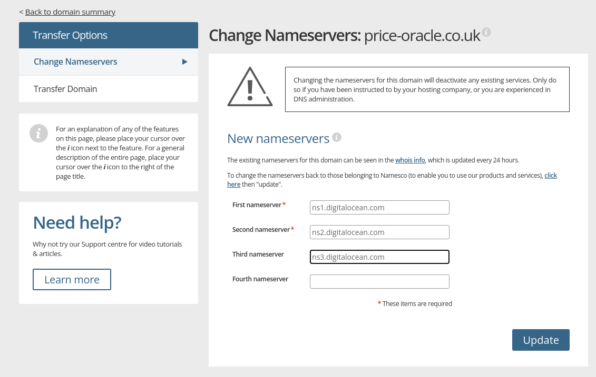

# Cloud Deployment Introduction 

We have provided a number of ways to run the Valory stack across multiple different cloud providers.

The deployment has been implemented using a minimal distribution of Kubernetes to run as close to the bare metal as allowable. 

This approach leads to a number of key benefits for node operators & infrastructure providers.

1. No reliance upon an individual provider. We currently provide coverage for both Digital Ocean and for AWS.
2. Lower costs compared to using a managed alternative.
3. Easily portable across cloud providers.

We have 3 deployment options available for external operators.
- docker-compose - This approach is advised for beginners/less experienced users.
- Kubernetes Cluster - We provide full deployments for Kubernetes:
    - Single Node - This deployment approach is recommended for individual applications.
    - Multi Node - This deployment approach is recommended for more advanced users looking to running multiple agent nodes or applications.

Infrastructure deployment is handled by Terraform to ensure replicability across multiple providers whilst allowing external operators to configure the deployments to match their specific deployment requirements.


# Kubernetes Cluster
# Pre-requisites

We require a domain for our cluster. This allow us to route traffic to our cluster controller node. This is a pre-requisite of both Kubernetes based deployments, however the docker-compose deployment is able to skip this step.

The domain can be aquired from a domain registrar such as [goDaddy](https://www.godaddy.com), or [Freenon](https://www.freenom.com). Most cloud providers also offer this as a service such as AWS. The key requirement is to be able to update the domain registrars NameServer (NS) records easily.

##Install depenencies.

- [Skaffold](https://skaffold.dev/docs/install/): Deployment Orchestration
- [Kind](https://kind.sigs.k8s.io/docs/user/quick-start/#installation): Local Cluster deployment and management.
- [Kubectl](https://kubernetes.io/docs/tasks/tools/): kubernetes cli tool.
- [Docker](https://docs.docker.com/get-docker/): Container backend.
- [Terraform](https://www.terraform.io/downloads.html): Infrastructure management as code.


#Step-by-step Deployment Instructions

1. Acquire the external operator code.
```bash
git clone git@github.com:valory-xyz/external-node-operators.git
```
## Setup Cloud Provider


## Digital Ocean
1. We need to first create an authentication file to be used by terraform to create cloud resources. This can be done from the [API Settings](https://cloud.digitalocean.com/account/api/tokens). Save this file within the root directory as ```infra/do_token```
2. Now we have our authentication token, we need to setup the domain we registered earlier. This is again done from the [Network & Domains](https://cloud.digitalocean.com/networking/domains) section of Digital Ocean.
3. Create a new domain by entering your domain 
{ align=center }

4. Once the domain has been setup on Digital Ocean, you will be provided with a list of Nameservers as so;
{ align=center }
You MUST configure your domain provider to point at these name servers like so;
{ align=center }

5. Once you have completed these steps, you are now ready to deploy the cluster to the infra structure.
```bash
cd infra/digital_ocean
terraform init # download required terraform packages
terraform apply # deploy resources and approve when prompted.
```
This will generate a kubeconfig which can be used to interact with the newly deployed resources. NOTE. This provides root access to the cluser so ensure that it is protected.

## AWS
1. Login to AWS console.
2. Create a Hosted Zone.
3. Use the Hosted Zones generated Nameservers to update the registrar with the correct Nameservers
4. Create a service account
5. Give the Service account the Dev-Ops Security group role
6. create an access key and token and then save this file to;
```infra/aws_token```
7. Once these steps are completed, the infrastructure can be deployed with;
```bash
cd infra/aws
terraform init # download required terraform packages
terraform apply # deploy resources and approve when prompted.
```

# Post Cluster Deployment Setup

Once the cluster has been deployed, we need to go ahead and actually deploy our application the cluster. We have included a number of convenice commands to speed this process up.

Depending upon the Cloud Provider selected above, the user must now point their Kubectl at the newly deployed cluster as so;

```bash
export KUBECONFIG=$(pwd)/infra/digital_ocean/kubefiles/kubeconfig
```

1. deploy cluster permissions and a dashboard to view status
```bash
make cluster-setup
```
2. Create the deployment yamls
```bash
make cluster-create-deployments
```
3. deploy the yamls
```
make cluster-deploy
```
4. check the progress via the dashboard
```bash
make cluster-dashboard-start
```
This will print a URL along with a passsword to allow access to the kubernetes dahboard where you will be able to see the status of the running containers along with their logs.