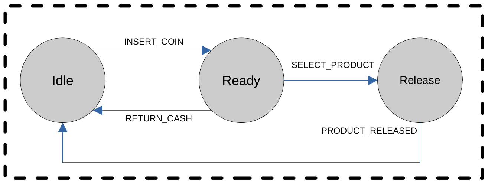

# Finite State Machines (FSMs)

A [finite state machine](https://en.wikipedia.org/wiki/Finite-state_machine) (FSM) is a mathematical model of computation that can be
used to represent the sequential logic of state transitions.
This lets us define all the steps that an application of service must follow, or in other words, the application logic.
At any given time
the FSM can be in exactly one particular state from which it can transition to
other states based on the inputs/events it is given. An FSM can be represented by a
graph, with a finite number of nodes describing the possible states of the
system, and a finite number of arcs representing the transitions from one state
to another. In this section we discuss the role FSMs play in the construction
of ABCI applications and the operation of AEAs.

We use FSMs to describe systems that have multiple states and can transition from one state to another due to some event or signal. In every state, we will need to perform one or more actions to trigger an event. This event will make the machine transition to a new state.

As an example, we can use a FSM model to describe a vending machine with three different states:

- Idle: the machine just waits for some event to happen.
- Ready: a product has been paid and the machine is ready to release it.
- Release: the machine releases the selected product.

And four different events:

- Insert coin
- Select product
- Return cash
- Product released

We can represent these in a FSM diagram:

## How Valory Apps use FSMs

Departing from this basic notion of FSM, we are now in position to describe in more detail how they are implemented in the Valory stack. Namely, what are the components that are changing when we transition from one state to another. For a Valory app, a state consists of:

- A **round** is the component that defines the rules to transition across diferent
  states. It is a concrete implementation of `AbstractRound`. It usually involves
  interactions between participants, although this is not enforced
  at this level of abstraction. A round can validate, store and aggregate data
  coming from different agents by means of transactions. The actual meaning of
  the data depends on the implementation of the specific round. This component
  produces the `Events` that will enable the FSM transit from one state to another.

- A **behaviour** is the component that defines the actions to be executed at
  a particular state. It is a concrete implementation of `BaseState`, and contains the application logic for this state. It is scheduled for
  execution by the agents. Every behaviour is associated with a specific round.

- Finally, the **period state** is the component that contain shared information
  across sates. It provides access to the state data that is shared by the agents throughout the period and gets updated at the end of round. Therefore, it is not tied to any specific state, rather each state can update its contents. It is a concrete implementation of `BasePeriodState`.

We define a **period** as a sequence of rounds that are semantically meaningful.
While a round might just be a stage in
the consensus (e.g., waiting that a sufficient number of participants commit their
observations to the temporary tendermint blockchain), or a voting round (e.g.
waiting till at least one estimate has reached `ceil((2N + 1) / 3)` of the votes),
a period consists of a sequence of such stages in the FSM flow that achieve a
specific objective.

A concrete example of the state flow that define a period in a Valory app is our price oracle app, which aggregates asset prices from different data sources and submits the aggregation result to a blockchain. In this example a period is defined as follows:
>
    Period with N agents
        1. Collect observations from external APIs or prior rounds.
        2. Share observations until threshold of 2/3rd is reached.
        3. Compute on observations, reach consensus on the result.
        4. Construct a transaction that contains the aggregation result.
        5. Sign the transactions, again need 2/3rd majority.
        6. A single agent, randomly nominated as the keeper, sends the
           transaction to the chain. If it does not do this before a
           timeout event occurs, another agent is selected to be the
           keeper.
        7. Start over
>
