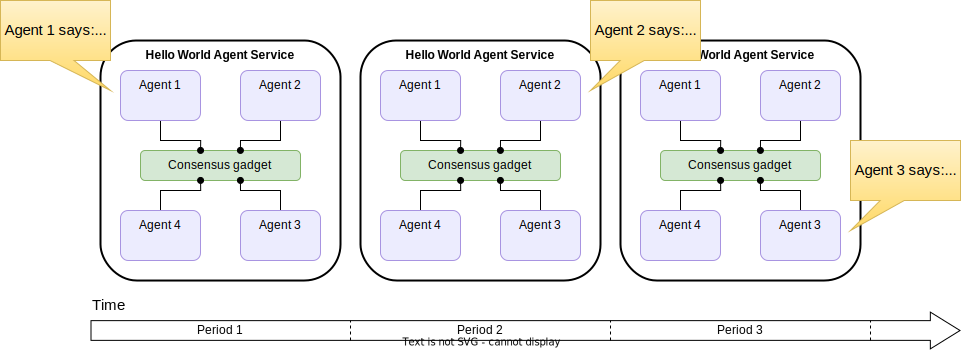

# Get Started

This section is aimed at giving a general, introductory overview of the library and a high-level view of the main elements that  an Agent Service, without delving into the specific details. Hopefully this will give and overall understanding on the development process and the main components involved, without needing to delve into the particular details.

We first start with a simple "hello world" example service, and we will add progressively more complexity and functionality to it.

## Hello World!
The goal is to come up with a service composed of four agents, each of which will print the message "Agent $i$ says: Hello world!" on the screen sequentially. That is, we divide the timeline into _periods_, and within each period, only one agent will print the message (the other agents will print nothing).

The {{agent_service}} architecture is as simple as it can be: four agents that are inherently connected through a _consensus network_.

<figure markdown>

<figcaption>Hello world {{agent_service}} architecture</figcaption>
</figure>

!!! info "Remember"

    Every {{agent_service}} has an associated consensus network, whose role will be discussed below in this section. Anything happening at the consensus network is completely transparent to the developer, and an application can be

This is what the service would look like in all its glory:

<figure markdown>

<figcaption>Hello world {{agent_service}} in action</figcaption>
</figure>

Even though printing "hello world" is not an exciting functionality, this example shows a number of key, nontrivial elements that make the {{valory_stack}}
