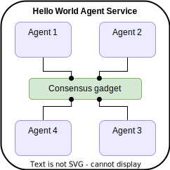
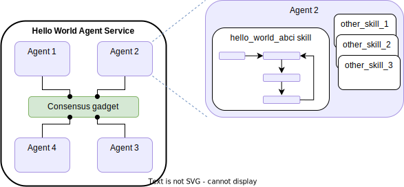
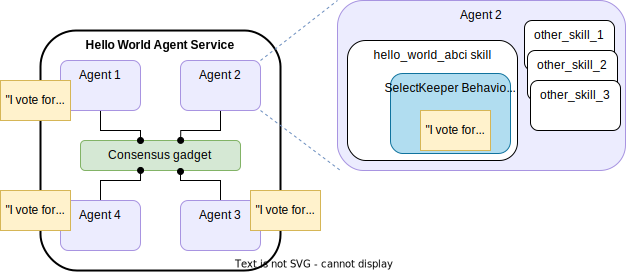
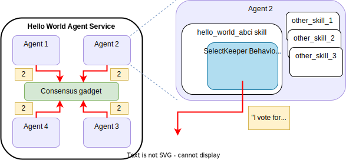
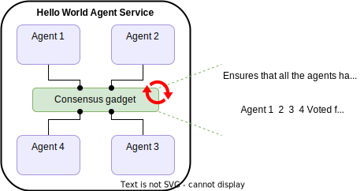
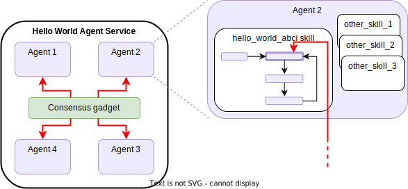
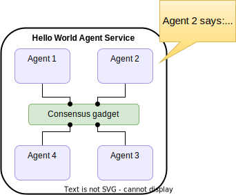
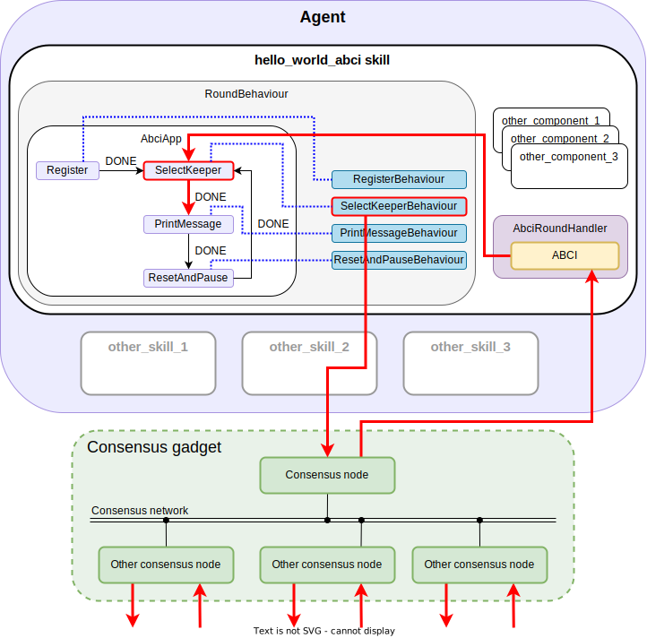

# Get Started

This section is aimed at giving a general, introductory overview of the library and a high-level view of the main elements that make an Agent Service, without delving into the specific details. Hopefully this will give and overall understanding on the development process and the main components involved, without needing to delve into the particular details.

We start with a simple "Hello World" example service, and we will add progressively more complexity and functionality to it.

## Hello World!
We start our tour to the framework by visiting an elementary example. The goal is to come up with a service composed of four agents. The functionality of this service will be extremely simple: Each agent will output the following message to its own console:
> "Agent $i$ says: Hello World!"

More concretely, we divide the timeline into _periods_, and within each period, _only one designated agent will print the message_. The other agents will print nothing. Think of a period as an interval where the service carries out an iteration of its intended functionality.

The architecture of this {{agent_service}} is as simple as it can be: four agents that are inherently connected through a _consensus mechanism_.

<figure markdown>

<figcaption>Hello World service architecture</figcaption>
</figure>

!!! warning "Important"

    Every {{agent_service}} has an associated *consensus mechanism*:

    * The consensus mechanism is the component that makes possible for the agents to reach agreement on certain decentralized operations.

    * Anything happening at the consensus network is completely transparent to the developer. An application run by the {{agent_service}} can be thought and developed as a single "virtual" application.

This is what the service would look like in all its glory:

<figure markdown>

<figcaption>Hello World {{agent_service}} in action</figcaption>
</figure>

Even though printing "Hello World" on their local console is far from being an exciting functionality, this example shows a number of  nontrivial elements that are key elements in an {{agent_service}}:

* The service defines a sequence of "atomic" well-defined actions whose execution in the appropriate order achieves the intended functionality.
* The agents have to interact with each other to execute the overall functionality, and reach a consensus on a number of decisions at certain moments (e.g., who is the agent that prints the message in each period).
* The agents are also allowed to execute actions on their own. In this simple example it just consists of printing a local message.
* Agents have to use a global store for persistent data (e.g., which was the last agent that printed the message).

Of course, in this toy example we assume that the agent that prints the message will behave honestly. When this printing functionality is replaced by other critical operations, like sending a transaction to a blockchain, it is not enough with trusting that the agent will behave honestly, and further security and cryptographic mechanisms will be required.

The main questions that we try to answer at this point are:

* What are the main elements of the {{valory_stack}} to implement an {{agent_service}}?, and
* How do agents interact with the different components in an {{agent_service}}?

## The Finite State Machine of an {{agent_service}}

The first step when designing an {{agent_service}} is to divide the intended functionality into "atomic" steps. For example, for the Hello World service, we identify these steps as

1. Each agent registers to the service.
2. [If Step 1 OK] Agents select what is the next agent to print the message. We call this agent the _Keeper_.
3. [If Step 2 OK] The Keeper prints the message "Hello World" on its local console.
4. Pause for a while and go to Step 2.

The reader should have probably already identified Steps 2 and 3. Step 1 is a requirement in each {{agent_service}}: it is simply a preliminary stage where each agent shows its willingness to participate actively in the service. This will allow all the agents to have an idea on what agents are participating in the service. Step 4, on the other hand is also a standard step in services that "loop", like the Hello World service. It serves as a synchronization point to allow agents wait to ensure that all agents have finished their tasks.

Graphically, the sequence of atomic steps that the service is following can be seen as

<figure markdown>

<figcaption>Diagram of atomic operations of the Hello World service</figcaption>
</figure>

This sequence diagram of operations can be interpreted as a finite state machine (FSM) that defines the service. Ignoring network latency and delays caused by the underlying consensus mechanism, it can be considered that at any given time, **all agents have the same view of the service FSM**, and **all agents execute the same transitions**. This is one of the key concepts of the {{valory_stack}}.

!!! note

    FSMs are in fact an abstract model of computation. An FSM defines

    * a set of _states_,
    * a set of _events_, and
    * a _state transition function_.

    The state transition function indicates how to move from a given state once an event has been received. At any timepoint, an FSM can only be located at a given state (_current state_). You can find a brief introduction about FSMs on Wikipedia, but for our purposes it is enough to understand the three bullet points above.

    Note that, according to the most the rigorous definition of an FSM, besides the current state, the FSM "has no other memory." That is, it does not know _how_ it arrived at a given state. Of course, in order to develop useful {{agent_service}}s, the {{valory_stack}} equips these FSMs with persistent storage.

Each agent runs internally a process or application that implements the service FSM, processes events and transit to new states according to the state transition function. The component that encapsulates this functionality is an agent _skill_. As its name suggests, a skill is some sort of "knowledge" that the agent possesses.

Let us call `hello_world`the skill that encapsulates the Hello World functionality. A zoom on an agent would look like this:

<figure markdown>

<figcaption>Zoom on an agent.</figcaption>
</figure>

Observe that Agent 2 has three additional skills. In fact, an agent can have one or multiple skills, in addition to several other components. Skills can implement a variety of functionalities, not only FSMs.  

!!! warning "Important"

    All agents in an {{agent_service}} are implemented by the same codebase. The codebase implementing an agent is called a _canonical agent_, whereas each of the actual instances is called _agent instance_, or simply _agent_ for short.
    Each agent instance is then parameterized with their own set of keys, addresses and other required attributes.

## Transitioning through the FSM

But how exactly do an agent transition through the FSM? That is, how are the events generated, and how are they received?

To answer this question, let us focus on a concrete state, namely, the SelectKeeper state. Several things are expected when the service is at this point.

A high level view of what occurs is as follows:

1. Prepare the vote. Each agent determines what agent he wishes to vote for the new Keeper. Since there is the need to reach an agreement, we consider that each agent wants to vote for "Agent $M\pmod 4+1$," where $M$ is the value of the current period. Thus, the agent prepares an appropriate _payload_ that contains that information.

  

2. Send the vote. The hello_world skill has a component (_Behaviour_) that is in charge of casting the vote to the consensus mechanism.

  

3. The consensus mechanism reads the agents' outputs, and ensures transparently that the collection of responses observed is consistent.
    * Note that this does not mean that the consensus mechanism ensures that all the agents vote the same. Rather, it means that all the agents reach an agreement on what vote was sent by each of them.

  

4. Once the consensus phase is finished (and persistently stored in a blockchain), each agent is notified with the corresponding information via an interface called _ABCI_.

  

5. A certain skill component (_Round_) receives and processes this information. If a $2/3$ majority of the agents voted for a certain Keeper, then this value is stored to be used in future phases of the service. After finalizing all this processing, the same skill component outputs the event that indicates the success of the expected actions at that state.
6. The event cast in the previous step is received by the component that actually manages the service FSM (_AbciApp_). This component processes the event according to the transition function and moves the current state of the FSM appropriately.

  

!!! warning "Important"

    As illustrated by the example above, there are a number of components from a skill in the {{valory_stack}} that the developer needs to define in order to build an {{agent_service}}. More concretely, these are:

    * **`AbciApp`**: The component that defines the FSM itself and the transitions between states.
    * **`Rounds`**: The components that process the input from the consensus mechanism and outputs the appropriate events to make the next transition. **There must be one round per FSM state.**
    * **`Behaviours`**: The components that execute the proactive action expected at each state. E.g., cast a vote for a Keeper, print a message on screen, execute a transaction on a blockchain, etc. **There must be one behaviour per FSM state.**
    * **`Payloads`**: Associated to each behaviour. They define the contents of the transaction of the corresponding behaviour.
    * **`RoundBehaviour`**: This can be seen as the main class of the skill, which aggregates the `AbciApp` and ensures to establish a one-to-one relationship between the rounds and behaviours associated to each state of the FSM.

The hello_world skill therefore would look like something like this:

## Executing the Main Functionality

Still, the service has only transitioned to a new state on its FSM. But, what would happen in an actual execution of the service functionality?

Mimicking the steps that occurred in the previous state, it is not difficult to see that this is what would actually happen:

1. Upon entering the PrintMessage state, the associated behaviour, say `PrintMessageBehaviour` will be in charge of executing the appropriate functionality. For Agent 2, it will be printing the celebrated message "Agent 2 says: Hello World". The rest of the agents can simply do nothing.
2. In any case, a dummy message (e.g., a constant value) must be sent by all the agents so that the consensus mechanism does its work.
3. The consensus mechanism will execute its protocol
4. The result of the consensus will be forwarded to all the agents through ABCI.
5. The `PrintMessageRound` will receive a callback originated from the consensus mechanism. It will verify that all agents have responded, and it will then cast the `DONE` event.
6. The `AbciApp` will take over and process the event `DONE`, and move the current state of the FSM to the next state, ResetAndPause.

As a result, we have finished a "happy path" of execution of the FSM, concluding with the expected output:

<figure markdown>

<figcaption>Result of the execution the second period of the Hello World {{agent_service}}</figcaption>
</figure>

As a summary, find below an image which shows the main components of an agent and a skill presented in this section. Of course, this is not a complete picture of what is inside the agent, but it should give a good idea of what are the main elements that play a role in an {{agent_service}}.

<figure markdown>

<figcaption>Main components of an agent that play a role in an {{agent_service}}. Red arrows indicate a high-level flow of messages when the agent is in the SelectKeeper state.</figcaption>
</figure>

## Further Reading
While this walktrhough to a simple Hello World example gives a bird's eye view of the main elements that play a role in an {{agent_service}} and inside an agent, there are a few more elements in the {{valory_stack}} that facilitate building complex applications and interact with real blockchains and other networks. We refer the reader to the more advanced sections where we explore in detail the stack. 
