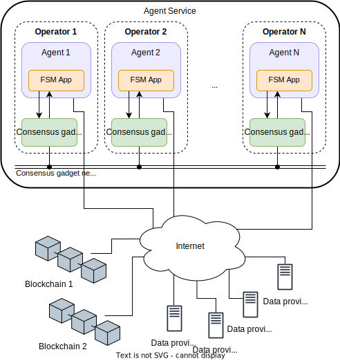
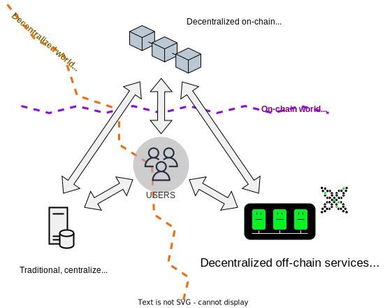

# Open Autonomy

_{{open_autonomy}}_ is a framework for the creation of Agent Services: off-chain services which run as a multi-agent-system (MAS) and are replicated on a temporary consensus gadget (blockchain) while being crypto-economically secured on a public blockchain, and which are operated in a robust, transparent and decentralized way.

The {{open_autonomy}} framework allows to define such services by means of _{{fsm_app}}s_. These dynamic, decentralized apps run inside the agents implementing the {{agent_service}}, and define its business logic. The {{fsm_app}}'s internal state is replicated across agents automatically through the consensus gadget. The {{open_autonomy}} framework is realized on top of the {{open_aea}} framework.

<figure markdown>

<figcaption>Agent Services are implemented with the Valory Stack as replicated ABCI Apps</figcaption>
</figure>

## Why?
Decentralized ledger technologies (DLTs), such as blockchains, face several challenges, for example:

* [the blockchain trilemma](https://www.ledger.com/academy/what-is-the-blockchain-trilemma)
* [the oracle problem](https://encyclopedia.pub/entry/2959),
* [privacy issues](https://en.wikipedia.org/wiki/Privacy_and_blockchain),
* [ledger storage space](https://cointelegraph.com/news/how-can-blockchain-improve-data-storage),
* [cross chain compatibility](https://101blockchains.com/blockchain-interoperability/), ...
* ... and the sheer complexity of the user experience!

In contrast with the increasing growth of on-chain applications (particularly in DeFi), the off-chain design space has seen a lack of innovation. A lot of the technology is centralized, lacks fault tolerance and offers little composability.

However, a standardised approach for off-chain application development in the context of DLTs is missing. This is where the Valory stack (i.e., the {{open_aea}} and the {{open_autonomy}} frameworks) comes in, as an open-source framework for developers to implement their own off-chain applications which are secured on-chain.

<figure markdown>

<figcaption>The Valory Stack allows to develop decentralized, off-chain {{agent_service}}s that are crypto-economically secure</figcaption>
</figure>

{{agent_service}}s go beyond simple, purely
reactive applications (like traditional smart contracts) and can show complex, proactive behaviours that contain off-chain logic without giving up on decentralization.

## How It Works

{{open_aea}} is a MAS framework for building
arbitrary agent-based apps. The {{open_autonomy}} framework extends this framework to a service architecture, where applications are implemented as sets of agents.

The {{fsm_app}} defines a series of steps that each agent in the {{agent_service}} must agree upon. At the end of every step, the agents must reach consensus on its outputs. This ensures that the execution flow, its
inputs and its outputs are replicated across all agents, creating a distributed and
decentralized application with shared state that is fault tolerant.

If at some point the application must execute an action involving an external service, e.g.,
settling a transaction on a blockchain, one of the agents is randomly nominated to perform that action. The nominated agent is known as a _keeper_. The nomination process is also agreed by consensus, and multi-signature protocols are used to avoid that a single, malicious agent executes an external action on its own.
For this reason, there is the requirement that a minimum number of agents approve and sign every action before it takes place, and it also must be verified once it has been processed. The threshold on the minimum number of agents is typically set at 2/3 of the total of agents.

## Where to Start

We recommend that new users start by reading the the [_Example of a service_](./service_example.md) section, which should give a general overview about how a simple {{agent_service}} is implemented with the stack.

Following that introduction, the reader can proceed to explore the core concepts that make {{agent_service}}s possible, presented in the _Concepts_ section:

- [Autonomous economic agents (AEAs) and multi-agent systems (MAS)](./aea.md),
- [Finite-state machines (FSMs)](./fsm.md), and
- the [Application BlockChain Interface (ABCI)](./abci.md).

These concepts constitute the starting point before exploring more advanced parts of the documentation.
