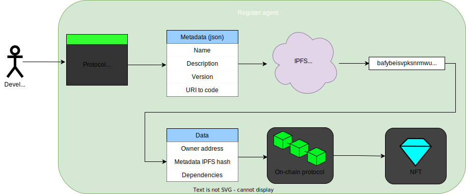
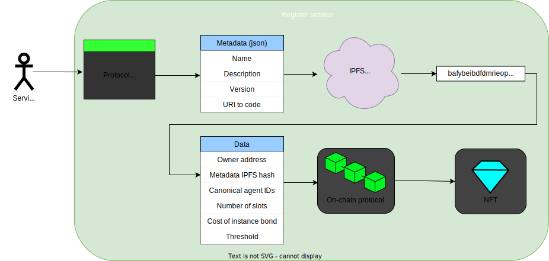

# Package publishing

Developers, node operators and service owners interact with each other through the on-chain protocol to register components, agents and services. Let's see how this all works starting with
a component inception all the way to a service deployment.

## Building a component

The first step begins with a developer creating a component that does something valuable in the context of the framework. This developer creates a software package with the {{open_autonomy}}
framework. That package, that we know as component, contains not only the code but also its configuration and dependencies (```component.yaml``` in the image). Once the package is completed,
it needs to be pushed to IPFS registry so other people can access to it. Using the ```autonomy``` CLI a developer can perform this action, and an IPFS hash that
points to this specific version of the code will be returned.

<figure markdown>

<figcaption>A developer creates a component and pushes it to the IPFS registry</figcaption>
</figure>

## Registering a component

Once the code has been tested and considered final, it is time to register the component in the on-chain protocol so other people can find it and reference it. Using the protocol frontend, the developer must fill a form with
the details of the package, like its IPFS hash, its owner address, description and so on. Once every detail has been filled out, the frontend will generate a ```json```
file with all the required metadata, push it to IPFS and retrieve the corresponding hash. After this, the developer can register that meta-data hash on the on-chain protocol and the component
owner will receive in his wallet an NFT that represents the ownsership of this component.

It is important to emphasize that two different pushes to IPFS have been
performed up to this point: the first one, done by the developer to push the code and a second one done through the frontend to push the metadata (that contains the code hash itself).

<figure markdown>

<figcaption>A developer registers a component into the protocol</figcaption>
</figure>

## Registering an agent

At some point, a service owner might want to create an agent that uses our useful component analogously to how some programs use other libraries. In an similar way to how a component was registered, this service owner
registers an agent, specifying all the components that make up the agent. A NFT will be minted as well and sent to the owner wallet.

Note that this agent is not a running agent, but a definition of an agent that node operators will later use to run to deploy decentralized services.

<figure markdown>

<figcaption>An operator registers an agent into the protocol</figcaption>
</figure>

## Registering a service

After the agent is registered, a service based on it can be registered as well. In the most simple case, a service could be run by a single agent, though this would mean that the service would be completely centralized and not fault-tolerant. It is expected that a service is run by multiple agents so it benefits from those features.

So a service owner registers the service based on the previously registered agent as well as the number of agent instances that will run the service. Once again, during this registration step a NFT is minted as well.

<figure markdown>

<figcaption>A service owner registers a service into the protocol</figcaption>
</figure>

## Registering an agent instance

Now, some node operators see this newly minted service in the protocol frontend, and find it interesting, so they decide to run one or more agents for it. While agent instance registration is open, operators are able to register their agent addresses. Once all open slots are filled, instance registration closes and the service can start running.

<figure markdown>

<figcaption>An operator registers an agent instance into the protocol</figcaption>
</figure>

## Running a service

Every piece is in place now. The only remaining thing is actually spinning up the service. Node operators run their agents using the ```autonomy``` CLI, the agents
form a network and the service is established. This service can be monetized and the revenue generated from the service users will be distributed among the component creators, service owners, node operators and the onchan protocol itself.

<figure markdown>

<figcaption>An operator runs an agent that forms part of a service</figcaption>
</figure>