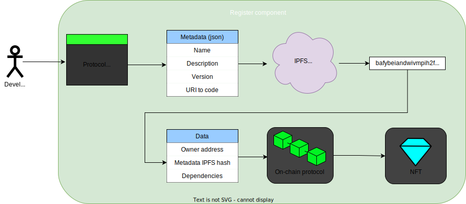

# Package publishing

Developers, node operators and service owners interact with each other through the on-chain protocol to register components, agents and services. Let's see how this all works starting with
a component inception all the way to a service deployment.

## Building a component

The first step begins with a developer creating a component that does something valuable in the context of the framework. This developer creates a software package with the {{open_autonomy}}
framework. That package, that we know as component, contains not only the code but also its configuration and dependencies (```component.yaml``` in the image). Once the package is completed,
it needs to be pushed to IPFS registry so other people can access it. Using the ```autonomy``` CLI a developer can perform this action, and an IPFS hash that
points to this specific version of the code will be returned.

<figure markdown>

<figcaption>A developer creates a component and pushes it to the IPFS registry</figcaption>
</figure>

## Registering a component

Once the code has been tested and considered final, it is time to register the component in the on-chain protocol so other people can find it and reference it. Using the protocol frontend, the developer must fill two different forms: one containing the package metadata and another with the package details for the on-chain protocol.

The metadata form includes:

- Package name
- Package description
- Package version
- URI to the code (including the code's IPFS hash)

This metadata will be included in a ```json``` file that will be pushed to IPFS and the corresponding metadata hash will be retrieved.

The on-chain protocol form contains:

- Package owner address
- Developer address
- Metadata IPFS hash (previously calculated in the metadata form)
- Package description
- Dependencies of the component (i.e. other components)

After all this details have been filled out and sent, the package will be registered on the on-chain protocol. The component
owner will receive in his wallet an NFT that represents the ownsership of this component.

It is important to emphasize that two different pushes to IPFS have been
performed up to this point: the first one, done by the developer to push the code and a second one done through the frontend to push the metadata (that contains the code hash itself).

<figure markdown>

<figcaption>A developer registers a component into the protocol</figcaption>
</figure>

## Registering an agent

At some point, a developer might want to create an agent that uses the previously registered component analogously to how some programs use other libraries. In an similar way to how a component was registered, this developer
registers an agent, specifying all the components that make up the agent. An NFT will be minted as well and sent to the owner wallet.

Note that this agent is not a running agent, but a definition of an agent, in the form of a package, that node operators will later use to create a service from.

<figure markdown>

<figcaption>A developer registers an agent into the protocol</figcaption>
</figure>

## Registering a service

After the agent is registered, a service based on it can be registered as well. Services are composed of one or more (canonical) agents. The service then specifies how many agent instances are required of each (canonical) agent. In the most simple case, a service could be composed of a single agent run as a single agent instance. However, this would mean that the service would be completely centralized and not fault-tolerant. Therefore, it is common that each agent in a service is run by multiple agent instances.

The service owner registers the service based on the previously registered agent as well as the number of agent instances that will run the service. Once again, during this service registration step an NFT is minted as well.

<figure markdown>

<figcaption>A service owner registers a service into the protocol</figcaption>
</figure>

## Registering an agent instance

Now, some node operators see this newly minted service in the protocol frontend, and find it interesting, so they decide to run one or more agent instances for this service. While agent instance registration is open, operators are able to register their agent addresses. Once all open slots are filled, instance registration closes and the service can start running.

<figure markdown>

<figcaption>A node operator registers an agent instance into the protocol</figcaption>
</figure>

## Running a service

Every piece is in place now. The only remaining thing is actually spinning up the service. Node operators run their agent instances using the ```autonomy``` CLI, the agents
form a network and the service is established. This service can be monetized and the revenue generated from the service users will be distributed among the component creators, service owners, node operators and the onchain protocol itself, as specified by the service owner.

<figure markdown>

<figcaption>A node operator runs an agent instance that forms part of a service</figcaption>
</figure>